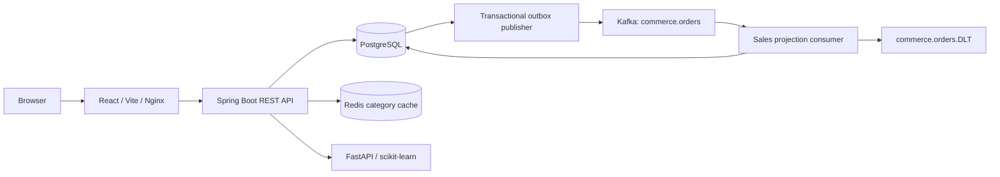

# E-Commerce Intelligence Platform

A full-stack portfolio application that connects an Indian Rupee storefront with transactional order processing, inventory operations and machine-learning insights derived from recorded sales and catalog data.


**Live demo:** A public live demo will be provided after deployment.

> Payments are explicitly simulated. Analytics use recorded paid orders; ML results are computed from supplied data. No production deployment, model-accuracy benchmark or hosted CI success is claimed.

[Features](#key-features) · [Architecture](#architecture-overview) · [Setup](#local-setup) · [API](#apibackend-overview) · [Testing](#testing-and-verification) · [Screenshots](#screenshots) · [Author](#author)

## Key features

- **Integrated commerce:** catalog discovery, cart, simulated checkout, order history and customer profiles.
- **Operational visibility:** product and category management, inventory auditing, fulfillment and sales/customer insights.
- **Transactional consistency:** server-calculated totals, inventory locking, checkout idempotency and immutable order price snapshots.
- **Data-backed intelligence:** content-based recommendations, demand forecasts and revenue anomaly detection, with explicit insufficient-data states.
- **Supporting infrastructure:** Redis category caching, Kafka transactional outbox, dead-letter handling, Docker Compose and GitHub Actions workflows.

## Customer features

- Responsive discover page with search, category selection, maximum-price filtering and name/price sorting.
- Product details, stock availability, bundled SVG illustrations and full-view/detail-close-up galleries.
- Related products from the recommendation service.
- Registration, login, logout and editable display-name profiles with purchase totals.
- Cart quantity controls, item removal and INR totals.
- Successful and declined simulated payments; declines retain the cart and inventory.
- Order history with item images, price snapshots, payment status and fulfillment progress.

The optional catalog seed contains **18 sample products across six categories**: Electronics, Workspace, Accessories, Home, Fashion and Beauty. It preserves existing inventory and orders and creates no sales or predictions. Images are local illustrations, not external image dependencies.

## Admin features

| Area         | Implemented capabilities                                                                           |
| ------------ | -------------------------------------------------------------------------------------------------- |
| Overview     | Paid-order revenue, order count, average order value, customer count and returning buyers          |
| Products     | Create, edit, select bundled images and archive/restore products; stale edits are rejected         |
| Categories   | Create, rename and control visibility in storefront filters                                        |
| Inventory    | Stock adjustments with reasons, movement history and low-stock information                         |
| Orders       | Paginated order history and sequential fulfillment: unfulfilled → processing → shipped → delivered |
| Customers    | Customer list, paid-order counts and total spend                                                   |
| Analytics    | Daily sales for the last 30 days and all-time product performance by units/revenue                 |
| Intelligence | Product demand forecasts and revenue anomaly results when sufficient history exists                |

Archiving preserves historical orders. Fulfillment updates require the current order version and are limited to paid orders. Category visibility controls the filter list; it does not automatically archive the category's products.

## E-commerce intelligence / ML

The Spring backend supplies catalog information and paid-order observations to a separate FastAPI service.

| Feature            | Method                                                                    | Data requirements and interpretation                                                                                               |
| ------------------ | ------------------------------------------------------------------------- | ---------------------------------------------------------------------------------------------------------------------------------- |
| Related products   | TF-IDF with cosine similarity over product name, description and category | At least two products with usable descriptive text; excludes the source product. Content-based, not user-behavior personalization. |
| Demand forecasting | Random Forest with lag, rolling-average and weekday features              | At least 35 completed days and seven sale days. The backend requests a seven-day forecast.                                         |
| Revenue anomalies  | Isolation Forest over log revenue and weekday                             | At least 30 completed days and seven revenue days. Flags are statistical signals for review.                                       |

Forecast responses include a computed seven-day chronological holdout MAE. This is a one-step validation measure, **not a claimed multi-step accuracy score**. Insufficient history produces an `insufficient_data` response; service failures do not generate substitute predictions. Sales dashboards query actual paid-order records independently of Kafka projection lag.

## Architecture overview



The frontend uses a same-origin `/api` proxy. Spring owns authentication, authorization and commerce writes; PostgreSQL is the system of record.

A successful checkout locks the customer account and product/inventory rows, calculates prices on the server, persists the order and outbox event, reduces stock and clears the cart in one transaction. The publisher marks events sent only after Kafka acknowledgement. Delivery is at least once; deduplicated processing protects the sales projection. Redis caches categories for 60 seconds and falls back to PostgreSQL when unavailable.

See [architecture and consistency](docs/ARCHITECTURE.md) for transaction boundaries, event handling and model limitations.

## Technology stack

| Layer                | Technologies in the repository                                                                                                                                    |
| -------------------- | ----------------------------------------------------------------------------------------------------------------------------------------------------------------- |
| Frontend             | React 19, TypeScript 5.9, Vite 7, React Router 7, Tailwind CSS 4, Axios, TanStack Query 5                                                                         |
| Backend              | Java 21, Spring Boot 3.5, Spring MVC, Spring Data JPA, Hibernate, Spring Security, JWT, Bean Validation, Actuator, Maven                                          |
| Database             | PostgreSQL, Flyway; Compose uses PostgreSQL 17                                                                                                                    |
| Cache and events     | Redis 7.4, Apache Kafka 3.9, Spring Data Redis, Spring Kafka, transactional outbox                                                                                |
| ML service           | Python 3.13, FastAPI, Uvicorn, Pandas, NumPy, scikit-learn                                                                                                        |
| Testing              | JUnit 5, Mockito, Spring Boot Test, MockMvc, Testcontainers, optional embedded/external PostgreSQL, Vitest, React Testing Library, jsdom, Pytest, Python unittest |
| Delivery and tooling | Docker, Docker Compose, Nginx, GitHub Actions, Prettier, CloudFormation, cfn-lint                                                                                 |
| AWS preparation      | CloudFormation for ECS/Fargate, ECR, RDS, ElastiCache, MSK, IAM, Secrets Manager, KMS and CloudWatch; OIDC release tooling. Deployment is not verified            |

Dependency versions are recorded in [backend/pom.xml](backend/pom.xml), [frontend/package.json](frontend/package.json), the npm lockfiles and [ML requirements](ml-service/requirements.txt).

## Project structure

```text
.
├── frontend/                 # React application, tests and local product images
├── backend/                  # Spring APIs, domain, security, events and Flyway migrations
├── ml-service/               # FastAPI models and Pytest suite
├── scripts/                  # Configuration, sample catalog, verification and release tools
├── infra/aws/                # CloudFormation templates and deployment instructions
├── .github/workflows/        # CI verification and manual AWS release workflow
├── docs/                     # Setup, architecture, verification and release notes
├── compose.yml               # Six-service local stack
├── .env.example              # Environment variable schema; no usable secrets
└── SECURITY.md               # Security reporting and operational guidance
```

## Authentication and security

- Passwords are hashed with bcrypt. Registration assigns the `CUSTOMER` role; admin APIs require `ADMIN`.
- HS256 JWTs expire after 15 minutes and are held in browser memory. Reloading requires signing in again.
- Cart, profile and order access derive ownership from the verified JWT subject.
- CORS uses explicit allowed origins. Local defaults cover `localhost` and `127.0.0.1` on ports 5173 and 8088; credentialed CORS is disabled.
- Validation, structured API errors, optimistic version checks and database constraints guard writes.
- Checkout uses a customer-scoped `Idempotency-Key`; concurrent inventory tests check overselling protection.
- ML endpoints require a service token. Product images use an allowlist of bundled assets.
- Request logging records IDs, paths, status and duration without logging request bodies or tokens.
- A per-process authentication rate limiter exists; production requires shared/edge throttling and TLS.

Refresh tokens, password recovery and server-side token revocation are not implemented. See [SECURITY.md](SECURITY.md) for reporting and deployment considerations.

## Database and migrations

Flyway manages schema changes; Hibernate validates the resulting schema rather than generating it. Core tables cover users, categories, products, inventory, carts, orders/items, inventory movements, outbox events, processed events and sales facts.

| Migration | Purpose                                                                                                        |
| --------- | -------------------------------------------------------------------------------------------------------------- |
| V1        | Commerce schema, relationships, indexes and integrity constraints                                              |
| V2        | Legacy sample-data conversion to INR and product/order image paths                                             |
| V3        | History-query indexes                                                                                          |
| V4        | Display names, fulfillment/versioning, category visibility and archival of legacy verification catalog entries |

Prices and order snapshots use INR (₹). V2 is a fixed historical demonstration-data migration, not a live exchange-rate conversion. A fresh database starts without products or orders. Add new migrations instead of editing applied ones.

## API/backend overview

All commerce routes use the `/api` prefix. The table summarizes existing endpoints; it is not an OpenAPI specification.

| Access        | Routes                                                                                                  | Purpose                                                                            |
| ------------- | ------------------------------------------------------------------------------------------------------- | ---------------------------------------------------------------------------------- |
| Public        | `POST /auth/register`, `POST /auth/login`                                                               | Issue customer/admin sessions                                                      |
| Public        | `GET /products`, `/products/{id}`, `/categories`                                                        | Browse catalog; API supports `q`, `category`, `min`, `max`, `sort`, `page`, `size` |
| Public        | `GET /products/{id}/recommendations`                                                                    | Related-product results                                                            |
| Authenticated | `GET /profile`, `PUT /profile`                                                                          | Own profile and display-name update                                                |
| Authenticated | `GET /cart`, `POST /cart/{product}`, `PUT /cart/{product}`                                              | Read cart, increment an item, set quantity; zero removes an item                   |
| Authenticated | `POST /checkout`, `GET /orders`                                                                         | Simulated payment and own order history; checkout requires `Idempotency-Key`       |
| Admin         | `POST /admin/products`, `PUT /admin/products/{id}`                                                      | Create/update/archive products                                                     |
| Admin         | `GET /admin/categories`, `POST /admin/categories`, `PUT /admin/categories/{id}`                         | Category management                                                                |
| Admin         | `GET /admin/inventory`, `POST /admin/inventory/{id}/adjustments`, `GET /admin/inventory/{id}/movements` | Stock and audit history                                                            |
| Admin         | `GET /admin/orders`, `PUT /admin/orders/{id}/fulfillment`                                               | Order operations                                                                   |
| Admin         | `GET /admin/customers`, `GET /admin/analytics`                                                          | Customer and sales insights                                                        |
| Admin         | `GET /admin/intelligence/forecast/{id}`, `GET /admin/intelligence/anomalies`                            | ML insights                                                                        |

Backend health endpoints are `/actuator/health`, `/actuator/health/readiness` and `/actuator/health/liveness`. Readiness includes PostgreSQL; optional cache availability is not a readiness requirement.

## Local setup

### 1. Clone and configure

Install Git and Python 3.13. For the complete stack, install Docker Engine/Desktop with Linux containers and Compose v2.

```sh
git clone https://github.com/M-jahnavi08/e-commerce-intelligence-platform.git
cd e-commerce-intelligence-platform
python scripts/configure-local.py
```

The generator creates root `.env` with independent random secrets and leaves an existing file unchanged. [.env.example](.env.example) describes the required variables; its empty values are not usable credentials.

| Variable            | Purpose                                            |
| ------------------- | -------------------------------------------------- |
| `DATABASE_PASSWORD` | PostgreSQL password                                |
| `JWT_SECRET`        | JWT signing secret; at least 32 bytes              |
| `ML_SERVICE_TOKEN`  | Shared backend/ML service token; at least 32 bytes |
| `ADMIN_EMAIL`       | Local bootstrap administrator email                |
| `ADMIN_PASSWORD`    | Bootstrap administrator password                   |

Keep `.env` private and ignored by Git. Never put secrets in frontend `VITE_` variables. Compose reads root `.env` automatically; native Spring/Uvicorn processes require loading those values into their terminal environments. [Setup instructions](docs/SETUP.md#configuration) include Bash and PowerShell commands.

### 2. Run the complete Docker stack

```sh
docker compose config --quiet
docker compose up -d --build --wait --wait-timeout 240
docker compose ps
```

| Service          | Local access                                      |
| ---------------- | ------------------------------------------------- |
| Frontend         | [http://localhost:8088](http://localhost:8088)    |
| Backend          | [http://localhost:8080](http://localhost:8080)    |
| PostgreSQL       | `127.0.0.1:5432`, database/user `commerce`        |
| Redis, Kafka, ML | Internal Compose network; no host ports published |

Sign in using the administrator values in your local `.env`. The frontend's Nginx container listens on port 8080, published as host port 8088. Stop native services occupying the same host ports before starting Compose.

### 3. Populate the optional sample catalog

```sh
python scripts/demo-data.py
```

This creates/updates the 18 sample products and a sample customer account. Customer credentials are stored only in `.env`. Existing orders and stock are preserved. The script targets backend port 8080; `COMMERCE_BASE_URL` can override the backend URL.

Register or sign in as a customer, browse products, add an item and try both simulated payment outcomes. Use **Workspace** as admin to inspect inventory, orders, customers and insights. A new database should display insufficient-history messages for forecasts/anomalies.

### 4. Inspect or stop services

```sh
docker compose logs --tail=100 backend frontend ml
docker compose down
```

The normal shutdown retains PostgreSQL and Kafka volumes. Deleting volumes erases their persisted data.

### Native development alternative

Install **Java 21, Maven 3.9+, Node 22.12+, Python 3.13 and PostgreSQL**. Create database/user `commerce` with the configured password, or start just the database using `docker compose up -d --wait postgres`. Load root `.env` into each backend/ML terminal first.

Run these in separate terminals:

```sh
# Backend
cd backend
mvn spring-boot:run
```

```sh
# ML service
cd ml-service
python -m venv .venv
# Activate: . .venv/bin/activate (Bash)
# Or: .venv\Scripts\Activate.ps1 (PowerShell)
python -m pip install -r requirements.txt
python -m uvicorn app.main:app --host 127.0.0.1 --port 8000
```

```sh
# Frontend
cd frontend
npm ci
npm run dev
```

Open [http://127.0.0.1:5173](http://127.0.0.1:5173). Vite proxies `/api` to port 8080. Defaults use PostgreSQL on port 5432 and ML on port 8000; override `DATABASE_URL`, `DATABASE_USER`, `DATABASE_PASSWORD` or `ML_URL` as needed.

Redis and Kafka are disabled by default in native mode; paid orders still persist outbox events. Compose enables both integrations with internal service addresses. Its Kafka advertised listener is for container-network clients, not a host JVM. Workspace-specific launchers and ECJ helpers depend on ignored local tools and are not the fresh-clone setup path.

## Testing and verification

| Area               | Existing coverage                                                                                                                                                                         | Command / directory                                         |
| ------------------ | ----------------------------------------------------------------------------------------------------------------------------------------------------------------------------------------- | ----------------------------------------------------------- |
| Backend            | PostgreSQL integration contract, concurrent stock/cart writes, idempotency, ownership, roles, profiles, fulfillment, image validation, CORS, cache fallback, outbox and DLT configuration | `mvn verify` in `backend/`                                  |
| Frontend           | Catalog/search/error states, authentication, cart interactions, product gallery/admin editing, profile updates and INR formatting                                                         | `npm test` and `npm run build` in `frontend/`               |
| ML                 | Recommendations, forecasting/anomalies, validation, insufficient-data behavior and service authentication                                                                                 | `python -m pytest -q` in an activated `ml-service/` venv    |
| Repository         | Catalog assets, frontend health configuration, release auditing and AWS release tooling                                                                                                   | `python -m unittest discover -s scripts/tests -v` from root |
| Release candidates | Targeted secret/generated-file audit                                                                                                                                                      | `python scripts/audit-release.py` from root                 |

Backend Testcontainers tests need Docker. Embedded and external PostgreSQL alternatives share the integration contract; external tests must target a disposable `commerce_verification` database because they truncate test data. Do not interpret skipped database tests as integration success.

For a **disposable Compose stack**:

```sh
python scripts/verify-stack.py --compose --resilience
```

This suite exercises HTTP authorization, catalog, checkout, idempotency, ownership, inventory, analytics and ML, plus Redis TTL/fallback, Kafka delivery, projection deduplication, malformed-event DLT routing and outage recovery. It creates verification records and temporarily stops Redis/Kafka; do not run it against a presentation or production database.

### Verification status and limitations

The recorded local run on **2026-09-17** passed 19 backend tests, 10 frontend tests, 27 ML tests and 11 repository tests, plus TypeScript/Vite builds and the local ECJ backend compilation/packaging path. Customer/admin browser flows were checked against native PostgreSQL, Spring Boot and FastAPI.

In that development environment, standard Maven/javac encountered Windows filesystem access denial, and Docker was unavailable. **Complete current Compose/Redis/Kafka resilience verification remains external work.** Unit-level DLT/cache tests are not evidence of a successful live-broker run. GitHub Actions defines service tests, infrastructure validation and Compose checks; its manual AWS release workflow is gated by verification. Neither hosted CI success nor AWS deployment is asserted here.

See [verification commands](docs/VERIFICATION.md), [current evidence and limitations](docs/STATUS.md) and [AWS deployment preparation](infra/aws/README.md).

## Screenshots

Screenshots have not yet been added to the repository. The following are placeholders for actual application captures, not rendered mockups:

| View                                       | Screenshot status |
| ------------------------------------------ | ----------------- |
| Discover/catalog — desktop and mobile      | To be added       |
| Product gallery and related products       | To be added       |
| Cart, simulated checkout and order history | To be added       |
| Admin overview, inventory and customers    | To be added       |
| Forecast/anomaly insufficient-data states  | To be added       |

## Future enhancements

These are potential extensions, **not implemented features**:

- Real payment-provider integration, refunds and reconciliation.
- Refresh-token rotation, password recovery and account verification.
- Product reviews, wishlists, shipping addresses and shipment tracking.
- Behavior-based personalization and offline model training/versioning.
- Managed media uploads beyond the bundled image catalog.
- Production observability, shared rate limiting, retention policies and tested recovery procedures.
- Complete Docker resilience validation and verified cloud deployment with a public demo.

## Further documentation

- [Local configuration and setup](docs/SETUP.md)
- [Architecture and consistency](docs/ARCHITECTURE.md)
- [Testing and verification](docs/VERIFICATION.md)
- [GitHub release checklist](docs/RELEASE.md)
- [AWS prerequisites and operations](infra/aws/README.md)
- [Security guidance](SECURITY.md)

## Author

**M-jahnavi08** · [GitHub profile](https://github.com/M-jahnavi08)

Built as a portfolio project demonstrating full-stack commerce, transactional data consistency and integrated machine-learning services.
