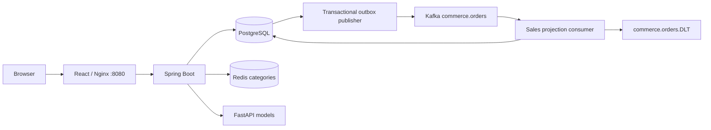

# Architecture and consistency

The frontend talks to the Spring API through a same-origin reverse proxy. Spring owns identity, all commerce writes, authorization and data collection for ML. PostgreSQL is the system of record. Redis caches category metadata only; an unavailable cache falls back to PostgreSQL.

## Checkout

1. Lock the authenticated account, serializing cart changes and duplicate checkout attempts for that customer.
2. Return an existing order for a matching idempotency key. Reject reuse with a different simulated payment outcome.
3. Read cart lines in product-ID order, lock each product and inventory row, validate available stock and calculate totals from database prices.
4. A declined simulated payment stores the failed order but leaves cart and stock unchanged.
5. A successful simulated payment decrements inventory, appends movements, persists order snapshots and an outbox event, and clears the cart in one transaction.

Cross-customer lock ordering avoids the common multi-product deadlock. Database check constraints enforce nonnegative inventory and prices. A rollback leaves no order or event behind.

## Event lifecycle

The publisher locks up to 50 pending events with `FOR UPDATE SKIP LOCKED`. It waits for Kafka acknowledgement before setting `published_at`. A crash between broker acknowledgement and commit can cause duplicate delivery; this is intentional at-least-once behavior. `processed_events` and `sales_facts` are committed together, making replay idempotent. Analytics currently query source orders, so Kafka lag does not invent or suppress reported sales.

The bounded retry/DLT configuration avoids silently discarding poison records. Operators must monitor and reconcile DLT entries. The polling publisher holds a database transaction during sends; move to a lease/claim or CDC publisher when throughput warrants it. Add outbox retention and age alarms before production.

## ML contracts

`POST /recommendations`: active catalog text → TF-IDF cosine similarities, excludes the source product.

`POST /forecast`: complete daily paid quantities → random forest using lag-1, lag-7, rolling means and weekday; 7-day chronological holdout and recursive future forecast. Requires 35 calendar days and 7 sale days.

`POST /anomalies`: complete daily paid revenue → Isolation Forest on log revenue and weekday. Requires 30 calendar days and 7 revenue days. Statistical flags require human review.

History starts at the first recorded paid sale. Missing days in a fully queried interval mean zero sales, not unknown events. The synchronous model path is bounded to 5,000 catalog items and 3,660 historical observations; the backend currently queries one year. Longer histories and high request volumes need offline training, stored model artifacts and controlled batch jobs.

## Security

Public routes expose active products/categories/recommendations. Cart and order ownership derives only from a verified JWT subject. Admin routes require the signed ADMIN role. Registration always assigns CUSTOMER. Passwords use bcrypt with a UTF-8 byte limit. Credentials are environment-driven; there are no committed admin passwords. CSRF is disabled because authentication uses an explicit Bearer header, not cookies. CORS permits one configured origin.

The per-process login limiter is suitable for development only. Use WAF or shared throttling behind proxies, enforce TLS, restrict service networks and secrets access, and rotate credentials for production. Log request IDs and durations without request bodies, passwords or tokens.

## Deployment topology

Compose publishes frontend 8088 and backend 8080 on host loopback. In Fargate, all three application containers share task networking: frontend uses 8080, backend 8081, ML 8000. Data services remain private. See the AWS guide for secrets, TLS, readiness, OIDC release permissions and infrastructure prerequisites.
